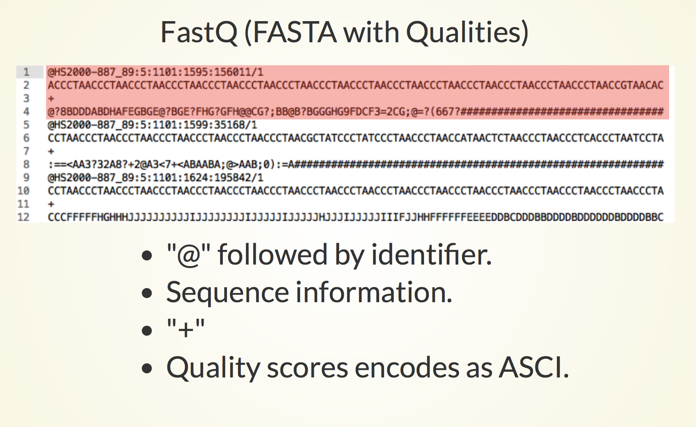

```{r setup, include=FALSE}
knitr::opts_chunk$set(echo = TRUE)
AsSlides <- TRUE
```

```{r setup2, include=FALSE,eval=FALSE,echo=FALSE}
library(ShortRead)

fqSample <- FastqSampler("~/Downloads/ENCFF001NQP.fastq.gz",n=10^6)
temp <- yield(fqSample)


writeFastq(fastqSample,file = "~/Projects/Software/Github/RUBioconductor_Introduction/r_course/Data/sampled_ENCFF000CXH.fastq.gz",mode = "w")
```

# ChIP-seq introduction 

Chromatin precipitation followed by deep sequencing (**ChIP-seq**) is a well established technique which allows for the genome wide identification of transcription factor binding sites and epigenetic marks. 

<div align="center">

</div>

---
# ChIP-seq introduction 

.pull-left[
<div align="center">

</div>
]

.pull-right[

* Cross-linked and protein bound DNA.
* Enrichment by antibody for specific protein or DNA state.
* End repair, A-tailed and illumina adaptors added.
* Fragments sequenced from one/either end.
]
---
# Raw Sequence data.

Our raw ChIP-seq sequencing data will be in FASTQ format.

<div align="center">

</div>


---
# Raw ChIPseq Sequence data.

In this ChIP-seq workshop we will be investigating the genome wide binding patterns of the transcription factor Myc in mouse MEL and Ch12 cell lines.

We can retrieve the raw sequencing data from Encode website.

Here we download the sequencing data for the Myc ChIP-seq from the Mouse MEL cell line[, sample **ENCSR000EUA** (replicate 1), using the Encode portal.](https://www.encodeproject.org/experiments/ENCSR000EUA/)

The direct link to the raw sequecing reads in FastQ format can be found [here.](https://www.encodeproject.org/files/ENCFF001NQP/@@download/ENCFF001NQP.fastq.gz)

Download the fastQ for the other Myc MEL replicate from [sample ENCSR000EUA](https://www.encodeproject.org/experiments/ENCSR000EUA/). Direct link is [here](https://www.encodeproject.org/files/ENCFF001NQQ/@@download/ENCFF001NQQ.fastq.gz).


---

# Working with raw ChIPseq sequence data.

Once we have downloaded the raw fastQ data we can use the [ShortRead package](https://bioconductor.org/packages/release/bioc/html/ShortRead.html) to review our sequence data quality.

We have reviewed how to work with raw sequencing data in the [**FastQ in Bioconductor** session.](https://rockefelleruniversity.github.io/Bioconductor_Introduction/r_course/presentations/slides/FastQInBioconductor.html#1)

First we load the [ShortRead library.](https://bioconductor.org/packages/release/bioc/html/ShortRead.html)


```{r shortreada,include=FALSE}
library(ShortRead)
```

```{r shortread}
library(ShortRead)
```

---

# Working with raw ChIPseq sequence data.

First we will review the raw sequencing reads using functions in the [ShortRead package.](https://bioconductor.org/packages/release/bioc/html/ShortRead.html)

We however do not need to review all reads in the file to can gain an understanding of data quality. We can simply review a subsample of the reads and save ourselves some time and memory.

Note when we subsample we retrieve random reads from across the entire fastQ file. This is important as fastQ files are often ordered by their position on the sequencer.

---

# Working with raw ChIPseq sequence data.

We can subsample from a fastQ file using functions in **ShortRead** package.

Here we use the [**FastqSampler** and **yield** function](https://rockefelleruniversity.github.io/Bioconductor_Introduction/r_course/presentations/slides/FastQInBioconductor.html#39) to randomly sample a defined number of reads from a fastQ file. Here we subsample 1 million reads.

```{r mycRep1Reads,cache=TRUE}
fqSample <- FastqSampler("~/Downloads/ENCFF001NQP.fastq.gz",n=10^6)
fastq <- yield(fqSample)
```

---

# Working with raw ChIPseq sequence data.

The resulting object is a [ShortReadQ object](https://rockefelleruniversity.github.io/Bioconductor_Introduction/r_course/presentations/slides/FastQInBioconductor.html#9) showing information on the number of cycles, base pairs in reads, and number of reads in memory.

```{r mycRep1ReadsShortReadQ,cache=TRUE,dependson="mycRep1Reads"}
fastq
```

---

# Working with raw ChIPseq sequence data.

If we wished, we can assess information from the fastQ file using our [familiar accessor functions.](https://rockefelleruniversity.github.io/Bioconductor_Introduction/r_course/presentations/slides/FastQInBioconductor.html#13)

* **sread()** - Retrieve sequence of reads.
* **quality()** - Retrieve quality of reads as ASCI scores.
* **id()** - Retrieve IDs of reads.


```{r mycRep1ReadsAccessor,cache=TRUE,dependson="mycRep1Reads"}
readSequences <- sread(fastq)
readQuality <- quality(fastq)
readIDs <- id(fastq)
readSequences
```

---

# Quality with raw ChIPseq sequence data.

We can check some simple quality metrics for our subsampled fastQ data.

First we can review the overall reads' quality scores.

We use the [**alphabetScore()** function with our read's qualitys](https://rockefelleruniversity.github.io/Bioconductor_Introduction/r_course/presentations/slides/FastQInBioconductor.html#26) to retrieve the sum quality for every read from our subsample.


```{r mycRep1ReadsQScores,cache=TRUE,dependson="mycRep1Reads"}
readQuality <- quality(fastq)
readQualities <- alphabetScore(readQuality)
readQualities[1:10]
```

---

# Quality with raw ChIPseq sequence data.

We can then produce a histogram of quality scores to get a better understanding of the distribution of scores.

```{r mycRep1ReadsQScoresPlot,cache=TRUE,dependson="mycRep1ReadsQScores",fig.height=3,fig.width=8}
library(ggplot2)
toPlot <- data.frame(ReadQ=readQualities)
ggplot(toPlot,aes(x=ReadQ))+geom_histogram()+theme_minimal()
```


---

# Base frequency with raw ChIPseq sequence data.

We can review the occurrence of DNA bases within reads and well as the occurrence of DNA bases across sequencing cycles using the [**alphabetFrequency()**](https://rockefelleruniversity.github.io/Bioconductor_Introduction/r_course/presentations/slides/FastQInBioconductor.html#16) and [**alphabetByCycle()**](https://rockefelleruniversity.github.io/Bioconductor_Introduction/r_course/presentations/slides/FastQInBioconductor.html#26) functions respectively.

Here we check the overall frequency of **A, G, C, T and N (unknown bases)** in our sequence reads.

```{r mycRep1ReadsAlpFreq,cache=TRUE,dependson="mycRep1Reads"}
readSequences <- sread(fastq)
readSequences_AlpFreq <- alphabetFrequency(readSequences)
readSequences_AlpFreq[1:3,]
```


---

# Base frequency  with raw ChIPseq sequence data.

Once we have the  frequency of DNA bases in our sequence reads we can retrieve the sum across all reads.

```{r mycRep1ReadsAlpFreqSum,cache=TRUE,dependson="mycRep1ReadsAlpFreq"}
summed__AlpFreq  <- colSums(readSequences_AlpFreq)
summed__AlpFreq[c("A","C","G","T","N")]
```

---

# Assessment by cycle  with raw ChIPseq sequence data.

We can review DNA base occurrence by cycle using the [**alphabetByCycle()** function.](https://rockefelleruniversity.github.io/Bioconductor_Introduction/r_course/presentations/slides/FastQInBioconductor.html#26)

```{r mycRep1ReadsAlpByCycle,cache=TRUE,dependson="mycRep1ReadsAlpFreq"}
readSequences_AlpbyCycle <- alphabetByCycle(readSequences)
readSequences_AlpbyCycle[1:4,1:10]
```

---

# Assessment by cycle  with raw ChIPseq sequence data.

We often plot this to visualise the base occurrence over cycles to observe any bias.
First we arrange the base frequency into a data frame.

```{r mycRep1ReadsAlpByCyclePlot,cache=TRUE,dependson="mycRep1ReadsAlpFreq"}
AFreq <- readSequences_AlpbyCycle["A",]
CFreq <- readSequences_AlpbyCycle["C",]
GFreq <- readSequences_AlpbyCycle["G",]
TFreq <- readSequences_AlpbyCycle["T",]
toPlot <- data.frame(Count=c(AFreq,CFreq,GFreq,TFreq),
                     Cycle=rep(1:36,4),Base=rep(c("A","C","G","T"),each=4))

```

---

# Assessment by cycle  with raw ChIPseq sequence data.

Now we can plot the frequencies using ggplot2

```{r mycRep1ReadsAlpByCyclePlot2,cache=TRUE,eval=FALSE,dependson="mycRep1ReadsAlpByCyclePlot",fig.height=4,fig.width=8}

ggplot(toPlot,aes(y=Count,x=Cycle,colour=Base))+geom_line()
```

```{r mycRep1ReadsAlpByCyclePlot3,cache=TRUE,echo=FALSE,dependson="mycRep1ReadsAlpByCyclePlot",fig.height=4,fig.width=8}

ggplot(toPlot,aes(y=Count,x=Cycle,colour=Base))+geom_line()+ylim(150000,400000)
```
---

# Assessment by cycle  with raw ChIPseq sequence data.

We can also assess mean read quality over cycles. This will allow us to identify whether there are any isses with quality dropping off over time.

For this we use the [**as(*read_quality*,"matrix")**](https://rockefelleruniversity.github.io/Bioconductor_Introduction/r_course/presentations/slides/FastQInBioconductor.html#27) function first to translate our ASCI quality scores to numeric quality scores.

```{r mycRep1ReadsQByCycle,cache=TRUE,dependson="mycRep1ReadsAlpFreq"}
qualAsMatrix <- as(readQuality,"matrix")
qualAsMatrix[1:2,]
```

---

# Assessment by cycle  with raw ChIPseq sequence data.

We can now [visualise qualities across cycles using a boxplot.](https://rockefelleruniversity.github.io/Bioconductor_Introduction/r_course/answers/fastq_answers.html)

```{r mycRep1ReadsQByCyclePlot,cache=TRUE,dependson="mycRep1ReadsQByCycle",fig.width=8,fig.height=4}
boxplot(qualAsMatrix[1:1000,])
```

---

# Assessment by cycle  with raw ChIPseq sequence data.

In this case the distribution of reads quality scores and read qualities over time look okay. We will often want to access fastQ samples together to see if any samples stick out by these metrics.

Here we observed a second population of low quality scores so will remove some reads with low quality scores and high unknown bases.

---

# Filtering data

We will want to conserve our memory usage to [allow us to deal with loading large files.](https://rockefelleruniversity.github.io/Bioconductor_Introduction/r_course/presentations/slides/FastQInBioconductor.html#40)

Here we set up a **FastqStreamer object** to read in 100000 reads at a time. 

```{r out,eval=FALSE}
fqStreamer <- FastqStreamer("~/Downloads/ENCFF001NQP.fastq.gz", 100000)
```

---

# Filtering data

Now we [loop through file](https://rockefelleruniversity.github.io/Bioconductor_Introduction/r_course/presentations/slides/FastQInBioconductor.html#41), filter reads and [write out a FastQ](https://rockefelleruniversity.github.io/Bioconductor_Introduction/r_course/presentations/slides/FastQInBioconductor.html#37) of our filtered reads

```{r out1,eval=FALSE}
TotalReads <- 0
TotalReadsFilt <- 0
while (length(fq <- yield(fqStreamer))>0) {
    TotalReads <- TotalReads+length(fq)
    filt1 <- fq[alphabetScore(fq) > 300 ]
    filt2 <- filt1[alphabetFrequency(sread(filt1))[,"N"] < 10]
    TotalReadsFilt <- TotalReadsFilt+length(filt2)
    writeFastq(filt2,"filtered_ENCFF001NQP.fastq.gz",mode="a")
}
TotalReads
TotalReadsFilt
```

---
# Aligning ChIPseq reads

Following assessment of read quality and any read filtering we applied, we will want to align our reads to the genome so as to identify any genomic locations showing enrichment for aligned reads above background.

Since ChIPseq reads will align continously agaist our reference genome we can use [our genomic aligners we have seen in previous sessions.](https://rockefelleruniversity.github.io/Bioconductor_Introduction/r_course/presentations/slides/AlignmentInBioconductor.html#6) The resulting BAM file will contain aligned sequence reads for use in further analysis.

<div align="center">

</div>

---
# Creating a reference genome.

First we need to retrieve the sequence information for the genome of interest in [FASTA format](https://rockefelleruniversity.github.io/Genomic_Data/genomicFileFormats.html#/6)

We can use the [BSgenome libraries to retrieve the full sequence information.](https://rockefelleruniversity.github.io/Bioconductor_Introduction/r_course/presentations/slides/SequencesInBioconductor.html#4)

For the mouse mm10 genome we load the package **BSgenome.Mmusculus.UCSC.mm10**.

```{r fa1q, include=FALSE}
library(BSgenome.Mmusculus.UCSC.mm10)
```

```{r fa1, echo=TRUE}
library(BSgenome.Mmusculus.UCSC.mm10)
BSgenome.Mmusculus.UCSC.mm10
```

---
# Creating a reference genome.

We will only use the major chromosomes for our analysis so we may exclude random and unplaced contigs.
Here we cycle through the major chromosomes and create a [**DNAStringSet** object from the retrieved sequences](https://rockefelleruniversity.github.io/Bioconductor_Introduction/r_course/presentations/slides/SequencesInBioconductor.html#17).

```{r fa2,cache=FALSE,echo=TRUE}
mainChromosomes <- paste0("chr",c(1:19,"X","Y","M"))
mainChrSeq <- lapply(mainChromosomes,function(x)BSgenome.Mmusculus.UCSC.mm10[[x]])
names(mainChrSeq) <- mainChromosomes
mainChrSeqSet <- DNAStringSet(mainChrSeq)
mainChrSeqSet
```

---
# Creating a reference genome.

Now we have a **DNAStringSet** object we can use the [**writeXStringSet** to create our FASTA file of sequences to align to.](https://rockefelleruniversity.github.io/Bioconductor_Introduction/r_course/presentations/slides/SequencesInBioconductor.html#17)

```{r fa3, echo=TRUE,eval=FALSE}
writeXStringSet(mainChrSeqSet,
                "BSgenome.Mmusculus.UCSC.mm10.mainChrs.fa")
```


---
# QuasR ChIP-seq alignment - Sample table

We can align our raw sequence data in fastQ format to the new FASTA file of our mm10 genome sequence using the **QuasR** package.

As we have seen in previous sessions, [the QuasR package requires a sample table to specify alignment files.](https://rockefelleruniversity.github.io/Bioconductor_Introduction/r_course/presentations/slides/AlignmentInBioconductor.html#15)

The sample table requires is a tab-delimited file listing the path to fastq(s) to be aligned and the desired sample names.

```{r sampleTable1, echo=TRUE,eval=FALSE}
FileName <- "filtered_ENCFF001NQP.fastq.gz"
SampleName <- "Myc_Mel_1"
sampleTable <- data.frame(FileName,SampleName)
write.table(sampleTable,file="sampleTable.txt",sep="\t",quote=FALSE,row.names = FALSE)
```

```{r sampleTable1s, echo=FALSE,eval=TRUE}
FileName <- "filtered_ENCFF001NQP.fastq.gz"
SampleName <- "Myc_Mel_1" 
data.frame(FileName,SampleName)
```

---
# QuasR genomic with BSGenome object

We can now align our data by using the **qAlign()** function.

The **qAlign()** function requires the path to our sample table file and the path of a FASTA file to align sequence reads against.

```{r bsgenome, echo=TRUE,eval=FALSE}
library(QuasR)
qAlign("sampleTable.txt","BSgenome.Mmusculus.UCSC.mm10.mainChrs.fa")
```

---

# Aligning ChIPseq reads with Rsubread.

The **Rsubread** package offers a faster aligner than the QuasR package although the **Rsubread** package is only available on Mac OS and Linux.

For alignment with the **Rsubread** package we must first build our genome index for Rsubread using the **buildindex()** function.

The [**buildindex()** function simply takes the parameters of our desired index name and the FASTA file to build index from.](https://rockefelleruniversity.github.io/Bioconductor_Introduction/r_course/presentations/slides/AlignmentInBioconductor.html#34)


```{r index, echo=TRUE,eval=FALSE}
library(Rsubread)
buildindex("BSgenome.Mmusculus.UCSC.mm10.mainChrs",
           "BSgenome.Mmusculus.UCSC.mm10.mainChrs.fa")
```

---
# Aligning ChIPseq reads with Rsubread.

Having constructed our index, we can align our reads using the **Rsubread** package's **align()** function.

The [**align()** function accepts arguments for the index to align to, the fastQ to align, the name of output BAM, the mode of alignment (rna or dna) and the phredOffset.](https://rockefelleruniversity.github.io/Bioconductor_Introduction/r_course/presentations/slides/AlignmentInBioconductor.html#34)

Note that here we set the phredOffset to be 64. Rsubread will provide a warning if we set this wrong.

```{r rsalign, echo=TRUE,eval=FALSE}
align("BSgenome.Mmusculus.UCSC.mm10.mainChrs",
      "filtered_ENCFF001NQP.fastq.gz",
      output_file="filtered_ENCFF001NQP.bam",
      type="dna",phredOffset = 64)
```


---

# Sort and index reads.

As before, we sort and index our files using the [**Rsamtools** packages **sortBam()** and **indexBam()** functions respectively.](https://rockefelleruniversity.github.io/Bioconductor_Introduction/r_course/presentations/slides/AlignedDataInBioconductor.html#10)

The resulting sorted and indexed BAM file is now ready for use in external programs such as IGV as well as for further downstream analysis in R.

```{r sortindex, echo=TRUE,eval=FALSE}
library(Rsamtools)
sortBam("filtered_ENCFF001NQP.bam","SR_Myc_Mel_rep1")
indexBam("SR_Myc_Mel_rep1.bam")
```
---

# Mapped reads.

Now we have the index for the BAM file, we can retrieve and plot the number of mapped reads using [the **idxstatsBam()** function.](https://rockefelleruniversity.github.io/Bioconductor_Introduction/r_course/presentations/slides/AlignedDataInBioconductor.html#15)

```{r mapped1, echo=TRUE,eval=FALSE}
mappedReads <- idxstatsBam("../../../SR_Myc_Mel_rep1.bam")
TotalMapped <- sum(mappedReads[,"mapped"])
ggplot(mappedReads,aes(x=seqnames,y=mapped))+geom_bar(stat="identity")
```

```{r mapped, echo=FALSE,eval=TRUE,fig.width=5,fig.height=5}
mappedReads <- idxstatsBam("../../../SR_Myc_Mel_rep1.bam")
TotalMapped <- sum(mappedReads[,"mapped"])
suppressPackageStartupMessages(library(ggplot2))
ggplot(mappedReads,aes(x=seqnames,y=mapped))+geom_bar(stat="identity")+coord_flip()
```

---

# Create a bigWig

We can also create a bigWig from our sorted, indexed BAM file to allow us to quickly review our data in IGV.

First we use the [**coverage()** function to create an **RLElist object** containing our coverage scores.](https://rockefelleruniversity.github.io/Bioconductor_Introduction/r_course/presentations/slides/Summarising_Scores_In_Bioconductor.html#13)

```{r coverage, echo=TRUE,eval=FALSE}
forBigWig <- coverage("SR_Myc_Mel_rep1.bam")
forBigWig
```

---

# Create a bigWig

We can now export our [**RLElist object** as a bigWig using the **rtracklayer** package's **export.bw()** function.](https://rockefelleruniversity.github.io/Bioconductor_Introduction/r_course/presentations/slides/GenomicScores_In_Bioconductor.html#40)

```{r bw, echo=TRUE,eval=FALSE}
library(rtracklayer)
export.bw(forBigWig,con="SR_Myc_Mel_rep1.bw")
```


---
# Create a bigWig

We may wish to normalise our coverage to allow us to compare enrichment across samples.

We can use the [**weight** parameter in the **coverage()**](https://rockefelleruniversity.github.io/Bioconductor_Introduction/r_course/presentations/slides/Summarising_Scores_In_Bioconductor.html#19) to scale our reads to the number of mapped reads multiplied by a million (reads per million).

```{r weightedCover, echo=TRUE,eval=FALSE}
forBigWig <- coverage("SR_Myc_Mel_rep1.bam",weight = (10^6)/TotalMapped)
forBigWig
export.bw(forBigWig,con="SR_Myc_Mel_rep1_weighted.bw")
```

---
# BAM and bigWig


---

# Time for an exercise.

[Link_to_exercises](../../Exercises/chipseq_part1_exercises.html)

[Link_to_answers](../../Answers/chipseq_part1_answers.html)


